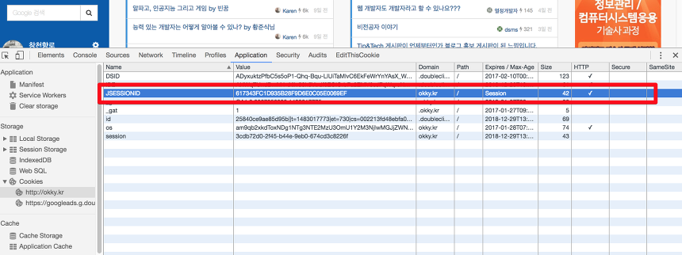

# 서블릿의 인스턴스화, Session, 멀티스레딩 관련 ([링크](https://www.notion.so/Session-4af9e728a7f44d4eb9fb8c4cccfc2141))

## 질문

---

다수의 서블릿이 있는 웹서버가 있습니다. 해당 서블릿들 간에 전달되는 값들은 session 변수와 인스턴스 변수에 할당해서 사용하고 있습니다.

이 상황에서 만약 2명 이상의 사용자가 해당 웹 서버에 request를 보내면 session 변수는 어떻게 되는건가요?

모든 사용자가 동일한 session 변수를 사용? 각 사용자 마다 session 변수가 다른가? 서로 다르다면 서버는 다른 사용자를 어떻게 구분하는가?

## 답변

---

### **ServletContext**

서블릿 컨테이너(아파티 톰캣)가 시작되면, 해당 서블릿 컨테이너는 모든 웹 애플리케이션들을 배포하고 로드(load)합니다.

웹 애플리케이션이 로드되면 서블릿 컨테이너는 `ServletContext`를 한번 생성하여, 서버의 메모리에 보관합니다.

이후 `web.xml`을 파싱하여 `<servlet>`, `<filter>`, `<listner>`가 발견되면 (혹은 `@Webselvet`, `@WebFilter`, `@WebListner` 어노테이션들로 지정된 클래스들) 해당 클래스들을 **한 번** 인스턴스 생성하고 서버의 메모리에 보관합니다.

각각의 인스턴스화가 된 필터는 본인의 `init()`메소드가 즉시 실행(invoked) 됩니다.

서블릿 컨테이너가 종료되면 모든 웹 애플리케이션들을 언로드(unload)하고, 모든 초기화된 서블릿 및 필터의 `destory()`메소드를 실행 후 `ServletContext`, `Servlet`, `Filter` 및 `Listener` 인스턴스들은 전부 삭제 됩니다.

서블릿에 0보다 큰 `<servlet><load-on-startup>`또는 `@WebServlet(loadOnStartup)` 값이 있을 경우 `init()` 메소드도 시작 중에 즉시 실행 됩니다.

이러한 서블릿은 해당 값(1이면 첫번째, 2이면 두번째)에 지정된 순러대로 초기화 됩니다.

1개 이상의 서블릿이 동일한 값을 가지고 있을 경우엔 `web.xml`또는 `@WebServlet` 클래스로딩에 등장하는 순서대로 로드됩니다.

만약 load-on-startup값이 없을 경우엔 해당 서블릿에 처음으로 `HTTP request`가 올 때 `init()`메소드가 실행됩니다.

### HttpServletRequest 및 HttpServletResponse

서블릿 컨테이너는 특정 포트 번호(8080포트는 일반적으로 개발단계에서 사용되고, 프로덕션(실서버)환경에서는 80포트)에서 HTTP request를 받는(listens) 웹 서버에 연결됩니다.

클라이언트(웹 브라우저를 가진 사용자)가 `HTTP request`를 보낼 때, 서블릿 컨테이너는 새로운 `HttpServeltRequest`와 `HttpServletResponse` 인스턴스를 생성하고 해당 인스턴스를 미리 정의된 필터 체인과 서블릿 인스턴스를 통과하도록 합니다.

필터의 경우 `doFilter()`메소드가 호출됩니다. `chain.doFilter(request, response)`를 호출하면 request와 response가 다음 필터로 넘어가거나, 남아있는 필터가 없는 경우 서블릿에 도달합니다.

서블릿의 경우 `service()`메소드가 호출됩니다. 기본적으로 이 메소드는 `request.getMethod()` 메소드를 기반으로 `doXXX(): doGet, doPost등` 메소드 중 하나를 호출합니다. 해당되는 메소드가 서블릿에 없으면 응답에 HTTP 405 에러가 리턴됩니다.

request 객체는 header와 body 같은 HTTP request에 대한 모든 정보를 갖고 있습니다.response 객체는 예를 들어 header와 body(일반적으로 JSP 파일에서 생성된 HTML 내용)을 설정하는 것처럼 당신이 원하는 방식으로 HTTP 응답을 보낼 수 있습니다.HTTP 응답이 완료되면 request 객체와 response객체는 모두 재활용되어 **재사용** 할 수 있습니다.

### HttpSession

클라이언트(웹 브라우저의 사용자)가 처음으로 웹 어플리케이션을 방문하거나 `request.getSession()`을 통해 HttpSession을 처음으로 가져 오면 서블릿 컨테이너는 새로운 HttpSession 객체를 생성하고 길고 unique한 ID를 생성 후, 서버의 메모리에 저장합니다. (`session.getId()`을 통해 가져올 수 있습니다.)또한 서블릿 컨테이너는 **JSESSIONID란 이름을** **key로, 생성한 session ID를 value로** 하여 HTTP 응답의 Set-Cookie header에 cookie로 설정합니다. (아래 OKKY 그림 참고)

웹 브라우저와 웹 서버가 준수해야 할 HTTP Cookie 스펙에 따라 클라이언트(웹 브라우저)는 cookie가 유효한 동안은 cookie header의 후속(subsequent) request에 cookie를 반환해야합니다. (즉, unique ID는 만료되지 않도록 **만료기간이 session**이어야 하며 도메인과 경로는 일치해야합니다).브라우저의 내장 HTTP 트래픽 모니터를 사용하면(Chrome / Firefox 23+ / IE9 +에서 F12 키를 누르고 넷 / 네트워크 탭을 선택) cookie가 유효한지 확인할 수 있습니다.



서블릿 컨테이너는 들어오는 모든 HTTP request의 cookie header에서 JSESSIONID라는 이름의 cookie가 있는지 확인하고 해당 값 (session ID)을 사용하여 서버의 메모리에 저장된 HttpSession을 가져옵니다.

HttpSession은 web.xml의 설정인 `<session-timeout>`에 지정된 값 까지만 살아있습니다.기본값은 30분입니다. 따라서 클라이언트가 time out보다 오래 웹 어플리케이션을 방문하지 않으면 서블릿 컨테이너가 session을 삭제합니다.모든 request는 지정된 cookie가 있더라도 더 이상 동일한 session에 액세스 할 수 없으며, 서블릿 컨테이너는 새로운 session을 생성 할 것입니다.

### JSESSIONID가 존재할 경우


### JSESSIONID가 없을 경우


클라이언트 측에서는 **웹브라우저 인스턴스**가 실행되는 동안 session cookie가 활성화됩니다. 따라서 클라이언트가 웹 브라우저 인스턴스(모든 탭 / 창)를 닫으면 클라이언트 session이 삭제됩니다.

새 브라우저에서 session과 연관된 cookie는 존재하지 않으므로 더 이상 cookie는 전송되지 않습니다. 이로 인해 새로운 HTTP Session이 생성되고 새로운 session cookie가 사용됩니다.

## 요약

---

ServletContext는 **웹 애플리케이션이 살아있는 한** 계속 살아있습니다. 그리고 그것은 모든 session에서 모든 request간에 공유됩니다.

클라이언트가 동일한 브라우저 인스턴스로 웹 어플리케이션과 상호 작용하고, session이 서버에서 time out되지 않은 한 HttpSession은 계속 유지됩니다.

**같은 session은 모든 request간에 공유**됩니다.

`HttpServletRequest`와 `HttpServletResponse`는 서블릿이 클라이언트로부터 `HTTP request`을 받을 때부터 완성된 응답이 도착할 때까지 살아있습니다. 그 외 다른 곳에서는 공유되지 않습니다. 모든 Servlet, Filter 및 Listener 인스턴스는 웹 어플리케이션이 살아있는 한 계속 살아있습니다.

ServletContext, HttpServletRequest 및 HttpSession에 정의 된 모든 attribute는 해당 객체가 살아있는 동안 지속됩니다.

객체 자체는 JSF, CDI, Spring 등과 같은 Bean Management Framework의 "scope"를 나타냅니다. 이러한 프레임워크는 scope가 지정된 bean을 attribute로 저장합니다. (역자주: bean의 scope를 session, request, singleton 등으로 지정할 수 있다는 이야기인것 같습니다.)

### Thread Safety

즉, 당신의 주요 관심사는 스레드 안전성이라고 할 수 있습니다.서블릿과 필터는 모든 request에서 공유된다는 사실을 이제 알았습니다. 그것은 Java의 멋진 점이며, 멀티 스레드와 다른 스레드 (HTTP request)는 동일한 인스턴스를 사용할 수 있습니다.그렇지 않으면 매 request마다 `init()` 및 `destroy()`를 다시 실행하기에는 너무 많은 비용이 듭니다.

또한 request나 session 에서 사용하는 데이터를 서블릿이나 필터의 **인스턴스 변수**로 할당해서는 안됩니다. 다른 session의 모든 request간에 공유되어 스레드로부터 안전하지 않습니다. 아래의 예가 이를 설명합니다.

```java
public class ExampleServlet extends HttpServlet {

    private Object thisIsNOTThreadSafe; //쓰레드에 안전하지 않은 변수

    protected void doGet(HttpServletRequest request, HttpServletResponse response) throws ServletException, IOException {
        Object thisIsThreadSafe; // 쓰레드에 안전한 지역변수

        thisIsNOTThreadSafe = request.getParameter("foo"); // BAD!! 모든 request가 공유합니다.
        thisIsThreadSafe = request.getParameter("foo"); // OK, 이건 쓰레드에 안전합니다.
    }
}
```

## 출처

---

[서블릿의 인스턴스화, session, 멀티스레딩에 관련된 질문과 답변에 대한 번역](https://jojoldu.tistory.com/118?category=635881)

[What is the difference between JSF, Servlet and JSP?](https://stackoverflow.com/questions/2095397/what-is-the-difference-between-jsf-servlet-and-jsp)
